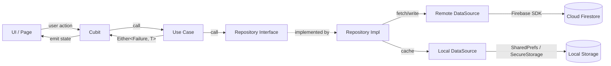

<p align="center">
  
</p>

<h1 align="center">Code of Steel (COS)</h1>

<p align="center">
  <strong>A programming education platform built with Flutter & Firebase</strong>
</p>

<p align="center">
  
  
  
  
  
</p>

---

## 📖 Overview

**Code of Steel** is a mobile learning app designed to help users master programming through structured courses, interactive quizzes, and AI-powered problem-solving challenges. Built with **Clean Architecture** principles, the app delivers a scalable, maintainable, and testable codebase.

### ✨ Key Features

| Feature | Description |
|---------|-------------|
| 🔐 **Authentication** | Email/password sign-up & login, Google Sign-In, email verification |
| 📚 **Courses** | Browse, purchase, save, favorite, and track progress through courses |
| 🎬 **Video Lessons** | Watch embedded YouTube video lessons per course |
| ❓ **Quizzes** | Timed, per-course quizzes with score tracking and history |
| 💻 **Problem Solving** | Coding challenges organized by difficulty levels with AI-powered code evaluation |
| 👤 **User Profiles** | Profile management with avatar, username, score, and level progression |
| 🌙 **Theming** | Light & Dark mode support |
| 🌍 **Localization** | Multi-language support (English + Arabic ready) |
| 📱 **Onboarding** | Welcome flow for first-time users |
| ⚙️ **Settings** | App configuration and user preferences |
| 🛠️ **Admin Panel** | Web-based admin dashboard for course management |

---

## 🏗️ Architecture

The project follows **Clean Architecture** with three distinct layers:

```
┌──────────────────────────────────────────────────────┐
│                   PRESENTATION                       │
│   Cubits · States · Pages · Widgets                  │
│   UI components and BLoC state management            │
│   Depends on: Domain layer only                      │
├──────────────────────────────────────────────────────┤
│                     DOMAIN                           │
│   Entities · Repositories (abstract) · Use Cases     │
│   Pure business logic — no external dependencies     │
├──────────────────────────────────────────────────────┤
│                      DATA                            │
│   Models · DataSources · Repository Implementations  │
│   Firebase, APIs, local storage integrations         │
└──────────────────────────────────────────────────────┘
```

### Design Patterns

| Pattern | Usage |
|---------|-------|
| **Repository** | Abstract data access; implementations in the data layer |
| **Use Case** | Single-responsibility business operations |
| **Cubit (BLoC)** | Simplified BLoC for state management |
| **Dependency Injection** | `get_it` service locator via `injection_container.dart` |
| **Either (Functional Error Handling)** | `dartz` `Either<Failure, T>` for all repository returns |
| **Factory** | DI container creates and manages instances |

---

## 📂 Project Structure

```
lib/
├── main.dart                          # App entry point & BlocProvider setup
├── injection_container.dart           # get_it DI registration for all features
├── restart.dart                       # App restart utility
├── firebase_options.dart              # Firebase configuration
│
├── core/                              # Shared utilities across features
│   ├── constants/                     # App-wide constants
│   ├── errors/                        # Exception & Failure classes
│   ├── network/                       # Network connectivity checker
│   ├── providers/                     # InheritedWidget-based data providers
│   ├── services/                      # App services (e.g. first-time check)
│   ├── usecases/                      # Base UseCase interface
│   ├── utils/                         # Input validators, helpers
│   └── widgets/                       # Shared widgets
│
├── features/                          # Feature modules (Clean Architecture)
│   ├── auth/                          # Authentication
│   ├── courses/                       # Course management
│   ├── quiz/                          # Quiz system
│   ├── problem_solving/               # Coding challenges & AI evaluation
│   ├── user_profile/                  # User profile management
│   ├── settings/                      # App settings & preferences
│   ├── theme/                         # Light/Dark theme
│   ├── localization/                  # Multi-language support
│   └── onboarding/                    # Welcome/onboarding flow
│
├── View/                              # UI pages & shared widgets
│   ├── home/                          # Home page with course listings
│   ├── courses/                       # Course detail, video, & choose pages
│   ├── favourites/                    # Favorite courses page
│   ├── saved/                         # Saved courses page
│   ├── profile/                       # User profile page
│   ├── settings/                      # Settings page
│   ├── problem_solving/               # Problem solving UI
│   └── shared/                        # Drawer navigation & reusable widgets
│
└── shared/                            # Cross-cutting shared code

admin_panel/                           # Web-based admin dashboard
├── index.html                         # Admin UI
├── app.js                             # Admin logic
├── styles.css                         # Admin styling
└── README.md                          # Admin panel docs
```

### Feature Module Structure

Each feature under `lib/features/` follows the same Clean Architecture layout:

```
feature_name/
├── domain/                            # Business logic (innermost layer)
│   ├── entities/                      # Business objects (Equatable)
│   ├── repositories/                  # Abstract repository interfaces
│   └── usecases/                      # Single-purpose business operations
├── data/                              # Data handling (outer layer)
│   ├── models/                        # DTOs with fromJson/toJson
│   ├── datasources/                   # Remote (Firebase) & local data sources
│   └── repositories/                  # Repository implementations
├── presentation/                      # UI layer
│   ├── cubit/                         # Cubit + State classes
│   ├── pages/                         # Full-screen pages
│   └── widgets/                       # Reusable UI components
└── feature_name.dart                  # Barrel export
```

---

## 🔧 Tech Stack

### Core

| Technology | Purpose |
|------------|---------|
| **Flutter 3.x** | Cross-platform mobile framework |
| **Dart 3.5** | Programming language |
| **Firebase Core** | Backend-as-a-Service |

### Firebase Services

| Service | Purpose |
|---------|---------|
| **Firebase Auth** | User authentication (Email, Google) |
| **Cloud Firestore** | NoSQL database for courses, quizzes, profiles |
| **Firebase Storage** | File & image storage |
| **Firebase Messaging** | Push notifications |
| **Firebase App Check** | App integrity verification |

### State Management & Architecture

| Package | Purpose |
|---------|---------|
| `flutter_bloc` | BLoC/Cubit state management |
| `get_it` | Dependency injection service locator |
| `equatable` | Value equality for entities & states |
| `dartz` | Functional programming (`Either` type) |
| `provider` | Widget-level state (Drawer controller) |

### UI & UX

| Package | Purpose |
|---------|---------|
| `cached_network_image` | Efficient image loading with caching |
| `smooth_page_indicator` | Page indicators for onboarding |
| `liquid_pull_to_refresh` | Animated pull-to-refresh |
| `percent_indicator` | Progress indicators for courses |
| `awesome_dialog` | Beautiful dialog boxes |
| `awesome_snackbar_content` | Styled snackbar messages |
| `timelines` / `timeline_tile` | Course progress timelines |
| `readmore` | Expandable text widgets |
| `flutter_swiper_view` | Swipeable card views |
| `loading_indicator` | Loading animations |
| `flutter_timer_countdown` | Quiz countdown timer |

### Media & Content

| Package | Purpose |
|---------|---------|
| `youtube_player_flutter` | YouTube video playback |
| `youtube_player_iframe` | Alternative YouTube player |
| `syncfusion_flutter_pdfviewer` | PDF document viewing |
| `flutter_code_editor` | Code editor for problem solving |
| `highlight` | Syntax highlighting |

### Storage & Networking

| Package | Purpose |
|---------|---------|
| `shared_preferences` | Light key-value local storage |
| `flutter_secure_storage` | Encrypted secure storage |
| `get_storage` | Fast key-value storage |
| `dio` | HTTP client for API calls |
| `http` | HTTP networking |
| `path_provider` | File system path resolution |
| `internet_connection_checker` | Network connectivity monitoring |

### Utilities

| Package | Purpose |
|---------|---------|
| `file_picker` | File selection for uploads |
| `permission_handler` | Runtime permissions |
| `share_plus` | Content sharing |
| `google_sign_in` | Google OAuth integration |

---

## 🚀 Getting Started

### Prerequisites

- **Flutter SDK** `>=3.5.3` — [Install Flutter](https://docs.flutter.dev/get-started/install)
- **Dart SDK** `>=3.5.3`
- **Firebase Project** configured for Android & iOS
- **IDE**: VS Code or Android Studio with Flutter plugin

### Installation

1. **Clone the repository**
   ```bash
   git clone https://github.com/Mohamed0khaled/COS-codeofsteel.git
   cd coursesapp
   ```

2. **Install dependencies**
   ```bash
   flutter pub get
   ```

3. **Configure Firebase**
   - Create a Firebase project at [console.firebase.google.com](https://console.firebase.google.com)
   - Add your Android & iOS apps
   - Download and place config files:
     - `android/app/google-services.json`
     - `ios/Runner/GoogleService-Info.plist`
   - Or use FlutterFire CLI:
     ```bash
     dart pub global activate flutterfire_cli
     flutterfire configure
     ```

4. **Run the app**
   ```bash
   flutter run
   ```

### Build for Production

```bash
# Android APK
flutter build apk --release

# Android App Bundle
flutter build appbundle --release

# iOS (requires macOS)
flutter build ios --release
```

> 📘 See [iOS_Release_Guide.md](iOS_Release_Guide.md) for detailed iOS deployment instructions.

---

## 📋 Feature Details

### 🔐 Authentication (`features/auth/`)

| Use Case | Description |
|----------|-------------|
| `LoginUseCase` | Email/password sign-in |
| `RegisterUseCase` | New user registration |
| `SignInWithGoogleUseCase` | Google OAuth authentication |
| `LogoutUseCase` | User sign-out |
| `GetCurrentUserUseCase` | Retrieve authenticated user |

**Flow:** Register → Verify Email → Login → Home Page

### 📚 Courses (`features/courses/`)

| Use Case | Description |
|----------|-------------|
| `SyncAndGetAllCourses` | Fetch & sync all courses from Firestore |
| `GetCourseDetails` | Get detailed course info |
| `PurchaseCourse` | Course purchase logic |
| `ApplyDiscountCode` | Apply discount codes |
| `CheckCourseOwnership` | Verify user owns a course |
| `ToggleFavorite` / `ToggleSaved` | Mark courses as favorite/saved |
| `UpdateCourseProgress` | Track lesson completion |
| `GetFavoriteCourses` / `GetSavedCourses` / `GetFinishedCourses` | Filtered course lists |

### ❓ Quizzes (`features/quiz/`)

| Use Case | Description |
|----------|-------------|
| `GetQuizzesByCourse` | Fetch quizzes for a specific course |
| `GetQuizById` | Get individual quiz details |
| `SubmitQuiz` | Submit quiz answers for grading |
| `SaveQuizResult` | Persist quiz results |
| `GetQuizHistory` | Retrieve past quiz attempts |
| `EvaluateCode` | AI-powered code evaluation |
| `StoreApiKey` | Save AI API key securely |

### 💻 Problem Solving (`features/problem_solving/`)

| Use Case | Description |
|----------|-------------|
| `GetAllLevels` | Retrieve difficulty levels |
| `GetLevelDetails` | Get level details & problems |
| `GetRandomProblem` | Get a random coding problem |
| `SubmitSolution` | Submit code solution |
| `EvaluateSolution` | AI-powered solution evaluation |
| `SaveEvaluationResult` | Persist evaluation results |
| `GetSolutionHistory` | View past submissions |
| `Get/SetPreferredLanguage` | Programming language preference |
| `HasApiKey` / `StoreApiKey` | Manage AI API key |

### 👤 User Profile (`features/user_profile/`)

| Use Case | Description |
|----------|-------------|
| `CreateUserProfileUseCase` | Initialize new user profile |
| `GetUserProfileUseCase` | Fetch profile data |
| `UpdateUsernameUseCase` | Change display name |
| `UpdateProfileImageUseCase` | Upload profile picture |
| `UpdateScoreUseCase` | Update user score/XP |

---

## 🗄️ Data Flow



---

## 🧪 Testing

```bash
# Run all tests
flutter test

# Run tests with coverage
flutter test --coverage
```

Test files follow the same feature structure:
```
test/
└── features/
    └── {feature}/
        ├── domain/usecases/
        ├── data/models/
        ├── data/repositories/
        └── presentation/cubit/
```

---

## 📱 Navigation

The app uses a **Drawer-based** navigation pattern:

| Drawer Item | Destination |
|-------------|-------------|
| 🏠 Home | Main course listing with search & categories |
| ⭐ Favourites | Courses marked as favorite |
| 💾 Saved | Courses saved for later |
| 👤 Profile | User profile, score, & level |
| ⚙️ Settings | App preferences, theme, language |
| 💻 Problem Solving | Coding challenges |
| 📧 Contact With Me | Developer contact info |

**App Launch Flow:**
```
App Start → Firebase Init → DI Init → Check Auth State
    ├── First Time User → Onboarding → Auth Page
    ├── Unauthenticated → Auth Page (Login/Register)
    └── Authenticated
        ├── Email Not Verified → Activate Page
        └── Email Verified → Home Page
```

---

## 🛠️ Admin Panel

A **web-based admin dashboard** (`admin_panel/`) for managing app content:

- Course CRUD operations
- Content management
- User management

> See [admin_panel/README.md](admin_panel/README.md) for setup instructions.

---

## 🤝 Contributing

1. Fork the repository
2. Create a feature branch: `git checkout -b feature/amazing-feature`
3. Follow the [Style Guide](STYLE_GUIDE.md) for code conventions
4. Commit your changes: `git commit -m 'Add amazing feature'`
5. Push to the branch: `git push origin feature/amazing-feature`
6. Open a Pull Request

---

## 📄 License

This project is proprietary software. All rights reserved.

---

<p align="center">
  Built with ❤️ using Flutter & Firebase
</p>
